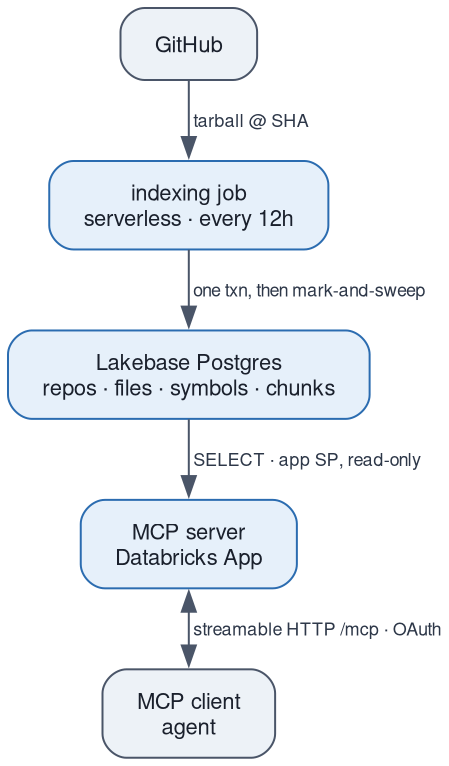
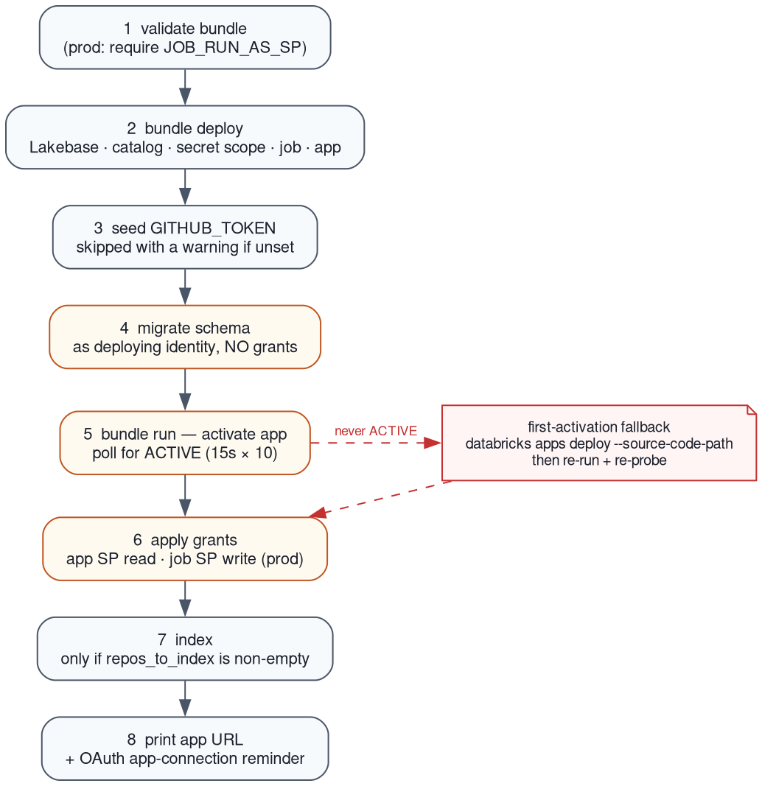

# databricks-code-search

An agent-facing code search service on Databricks: a scheduled job indexes GitHub
repositories into Lakebase Postgres, and an MCP server exposes that corpus to agents
over streamable HTTP with a zoekt-style query language.

It exists so an agent can grep a codebase it has never cloned. The corpus is shared and
read-only at query time; there is no per-user filtering, so only index repositories every
caller of the MCP endpoint is allowed to read.

## Architecture



The job resolves each repo's default-branch HEAD to an immutable SHA, downloads the
tarball for that SHA (no git binary — the job runs on serverless), parses every source
file, extracts symbols with tree-sitter, and writes files and symbols in a single
transaction stamped with that SHA. Files carrying an older commit are then swept, so a
failed run rolls back whole rather than leaving the corpus half-updated.

The server holds one process-scoped SQLAlchemy engine over a 5-connection pool, minting a
fresh Lakebase OAuth token on each physical connection. Query work runs off the event loop
under a 5-token limiter sized to the pool.

## Query language

`search_code` takes a zoekt-style query. Five fields are supported:

| Field | Meaning | Example |
|---|---|---|
| `repo:` | repository name, always case-insensitive | `repo:acme` |
| `file:` | file path | `file:src/` |
| `lang:` | language, lowercased; unknown values match nothing | `lang:go` |
| `sym:` | symbol name (correlated `EXISTS` over `symbols`) | `sym:Handler` |
| `case:` | `yes` or `no`; query-global, last one wins | `case:yes Foo` |

Values may be bare (`repo:acme`), quoted (`repo:"my repo"`), or regex
(`file:/foo\/bar/`). `repo:`, `file:`, and `sym:` values are treated as regex patterns and
are never escaped.

Content terms are substrings (`foo`, or `"a b"` to keep spaces) or regexes (`/Foo.*Bar/`).
Matching is **case-insensitive by default** — there is no smart-case inference like zoekt's.

Whitespace means AND, `OR` (any case) means OR, and AND binds tighter:

```
a b OR c d          ==  (a AND b) OR (c AND d)
(a OR b) (c OR d)   ==  parentheses override precedence
repo:acme lang:go /Foo.*Bar/
```

Not supported in V1. Most of these raise; the first two are silent, which is the more
dangerous case:

- **Negation.** `-foo` parses as a literal substring, with no error. If negation ships
  later, queries written today will silently flip meaning.
- **`AND` as a keyword.** `a and b` silently searches for the literal word `and`.
- **`content:` and `branch:`**, and the single-letter aliases `r` `f` `l` `b` `c` `s` —
  reserved, and raise a parse error.
- **Dangling `OR`** (`a OR`, `OR a`) and **empty groups** (`()`) raise.

### Regex is not RE2

Two different engines run in sequence, and neither is zoekt's RE2:

1. Postgres POSIX ARE (`~` / `~*`) selects which files match. Invalid patterns surface as
   a query-time database error, not a parse error.
2. Python `re` rescans those files to produce the highlighted line matches.

The practical consequences: `^` and `$` are line anchors and `.` never crosses lines;
a Postgres-valid pattern that Python `re` rejects contributes no highlights *for that atom*
and sets `regex_incompatible`, so a single-atom query of that shape returns nothing while
other atoms in the same query still match; and case folding can disagree on non-ASCII pairs
(`ß`/`SS`, Turkish dotless `ı`). ASCII is unaffected.

Line matching is also **highlight-driven** — a file appears only if some line produces a
non-empty highlight. A content-free filter query like `lang:go` on its own, or a zero-width
pattern like `/^/`, returns nothing even though the SQL predicate matched. `sym:` is the
exception: `search_code` runs a separate symbol leg, so `sym:Handler` returns definitions
(carrying `symbols` and a `line`, but empty `text`) rather than falling into this hole.

One more V1 limitation worth knowing before pointing agents at it: a
catastrophic-backtracking regex on a single under-cap file runs unbounded in Python and can
stall the server. `statement_timeout` bounds the database, not the rescan.

## MCP tools

| Tool | Parameters | Returns |
|---|---|---|
| `search_code` | `query`, `limit=200` | file-grouped line matches with byte ranges |
| `semantic_search` | `query`, `limit=50` | ranked chunks with `rrf_score` |
| `list_repos` | — | indexed repos with last-indexed metadata |
| `get_file` | `repo`, `path` | full file content, or `found: false` |

Every tool returns a JSON string. `limit` is clamped server-side: a non-positive value
falls back to 200, and anything above 1000 is capped there.

Recoverable conditions come back as payload fields —
`query_parse_error`, `query_too_broad`, `truncated`, `regex_incompatible` — rather than
errors, so an agent can react without a failed tool call.

`semantic_search` is natural-language hybrid search (vector ANN + BM25 fused by reciprocal
rank). It is registered unconditionally but gated at runtime: when disabled, which is the
default, it returns `semantic_enabled: false` and touches neither the database nor the
embedder. Turning it on means `CODE_SEARCH_SEMANTIC_ENABLED=1` *and* a separate,
irreversible migration — see
[`docs/runbooks/semantic-enablement.md`](docs/runbooks/semantic-enablement.md).

Two HTTP routes sit alongside the MCP mount: `GET /health` is liveness and never touches
the database, and `GET /ready` runs `SELECT 1 FROM repos LIMIT 1` so that a role holding
connect-but-not-select fails as 503 instead of shipping green.

## Out-of-band prerequisites

Four things the bundle cannot create. The first three gate a working MCP endpoint; the
fourth only matters for semantic search.

**1. Pre-created service principals.** An account admin creates the service principals
once; their client IDs become `app_sp_client_id` and `job_run_as_sp`. The bundle does not
create service principals. For prod, `make deploy-prod` refuses to run unless
`JOB_RUN_AS_SP=<client-id>` is set — that SP is declared as the `code-search-job-writer`
Postgres role and is what the indexing job runs as.

**2. Account-admin OAuth app connection.** MCP client auth on Databricks Apps is
**OAuth-only — there is no PAT path**. An account admin must register a Databricks OAuth
app connection (Account Console → Settings → App Connections) with the client's redirect
URLs, e.g. `http://localhost:<port>/oauth/callback` for Claude Code or Claude Desktop.
Until this exists, no external MCP client can reach `/mcp` — requests get an OAuth redirect
instead of a response.

`make smoke ARGS=--enable-mcp` is not blocked by this: it authenticates with your own
Databricks login (`WorkspaceClient().config.authenticate()`), so it needs `CAN_USE` on the
app but not the app connection. `deploy.sh`'s step-8 reminder says no client can reach
`/mcp` without the app connection; that holds for external MCP clients but not for
`make smoke`.

**3. GitHub token.** `make set-secrets` writes `GITHUB_TOKEN` into the bundle-created
secret scope (`code-search` / `github_token` by default). `make deploy` will do this for
you if `GITHUB_TOKEN` is exported; without it the deploy still succeeds and the app still
serves, but indexing has no credential and the corpus stays empty.

**4. Lakebase Search beta.** Semantic search only. The Lakebase project's
Databricks-managed `shared_preload_libraries` must already include
`lakebase_vector,lakebase_text`. This is not settable through the bundle or the API, it is
requested out-of-band per project, and **it is irreversible**.

## Deploy

```bash
make install                      # uv sync --all-groups
export GITHUB_TOKEN=ghp_...       # so deploy can seed the secret scope
make deploy TARGET=dev            # full ordered pipeline
```

For prod, the job run-as SP is mandatory:

```bash
JOB_RUN_AS_SP=<client-id> make deploy-prod
```

`make deploy` runs `scripts/deploy.sh full`:



1. **Validate** the bundle; for prod, assert `JOB_RUN_AS_SP` is non-empty.
2. **Deploy** resources — Lakebase project, UC catalog, secret scope, job, app. Compute is
   not started yet.
3. **Seed the GitHub secret** if it is missing and `GITHUB_TOKEN` is set; otherwise warn
   and continue.
4. **Migrate** the schema as the deploying identity, *without* grants.
5. **Activate** the app via `bundle run`, then poll for `ACTIVE` (15s × 10).
6. **Apply grants** — read-only for the app SP, write for the job SP on prod.
7. **Index**, if `repos_to_index` is non-empty.
8. **Print the app URL** and the reminder about the OAuth app connection.

Steps 4 and 6 are split because the app service principal's Postgres role does not exist
until the app first activates in step 5. Granting before activation cannot work, so the
grant pass runs after and retries (5 × 10s) to absorb role-visibility lag.

If step 5 never reaches `ACTIVE`, the script falls back to
`databricks apps deploy <app> --source-code-path`, re-runs `bundle run`, and re-probes. The
script calls this the first-activation fallback.

Configure which repositories get indexed with the `repos_to_index` bundle variable
(comma- or space-separated `org/repo`). It defaults to empty, which is why a fresh deploy
has an empty corpus and `make smoke` does not assert one unless you pass `--expect-indexed`.
Index on demand with `make index TARGET=dev`; otherwise the job runs every 12 hours.

### Smoke test

```bash
make smoke TARGET=dev                              # health, ready, connectivity
make smoke TARGET=dev ARGS=--expect-indexed        # also assert the corpus is non-empty
make smoke TARGET=dev ARGS=--enable-mcp            # also drive a real search_code call
```

`--enable-mcp` needs a populated corpus. `/ready` is the grant
oracle here — the direct-SQL check runs as the deploying identity and proves connectivity
only, so it will pass even when the app SP is missing its SELECT grant.

## Connecting a client

Point any MCP client at `https://<app-url>/mcp` over streamable HTTP and authenticate
through the OAuth app connection from prerequisite 2. `make deploy` prints the app URL;
`databricks apps get <app-name>` returns it later.

The caller also needs `CAN_USE` on the app. Machine-to-machine callers authenticate with
`DATABRICKS_CLIENT_ID` / `DATABRICKS_CLIENT_SECRET`; interactive ones go through the
redirect URL registered on the connection. A 302 where you expected JSON means the request
was unauthenticated — that is the single most common symptom of a missing or misconfigured
app connection.

## Local development

Requires Python 3.12+ and `uv`.

```bash
make install
make test                 # unit + observability; no external dependencies
make test-integration     # needs Postgres
make lint                 # ruff check + ruff format --check + mypy
```

The integration suite needs a Postgres with `pg_trgm`; CI uses `pgvector/pgvector:pg16`
with `PGHOST`/`PGPORT`/`PGUSER`/`PGPASSWORD`/`PGDATABASE` pointed at it. Do **not** run
`make migrate-local` first — the fixtures build their own schema, and a pre-migrated
database fails the suite on a duplicate-key violation against `repos_name_key`.
`make migrate-local` is for running the app locally, not the tests.

`LAKEBASE_ENDPOINT` and `PGHOST` are precedence-ordered, not exclusive: a configured
`LAKEBASE_ENDPOINT` always wins; `PGHOST` selects local mode only in its absence. That
ordering matters because the deployed app's Postgres binding injects `PGHOST` at runtime,
so both are set in production. Locally the risk runs the other way, which is why
`make smoke` and `make migrate` refuse to run with `PGHOST` set — otherwise a stale shell
variable could quietly point them at your laptop instead of the deployment.

Run the server locally with `make run` (binds `DATABRICKS_APP_PORT`, else 8000).

## Reference

- [`docs/runbooks/semantic-enablement.md`](docs/runbooks/semantic-enablement.md) — turning
  on semantic search
- [`docs/runbooks/ci-lakebase.md`](docs/runbooks/ci-lakebase.md) — running CI against a
  real Lakebase engine
- `docs/diagrams/*.dot` — Graphviz sources for the images above. The PNGs are committed;
  edit the `.dot` and run `make diagrams` rather than touching them.
- `make help` — every target with its flags
